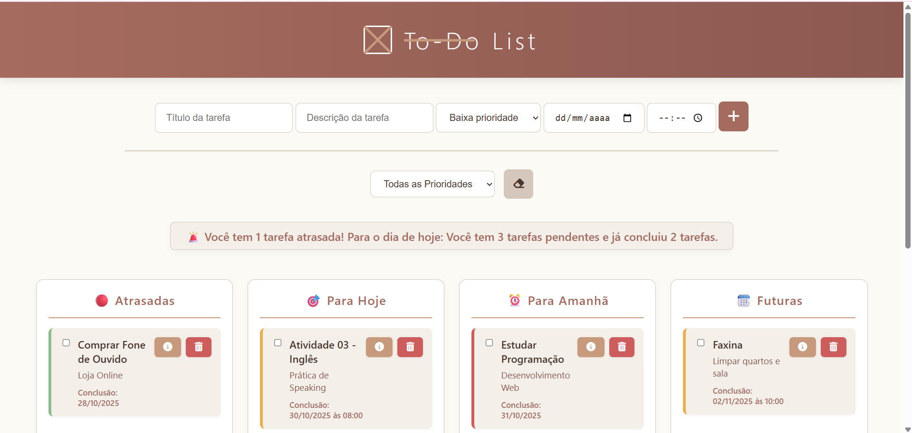
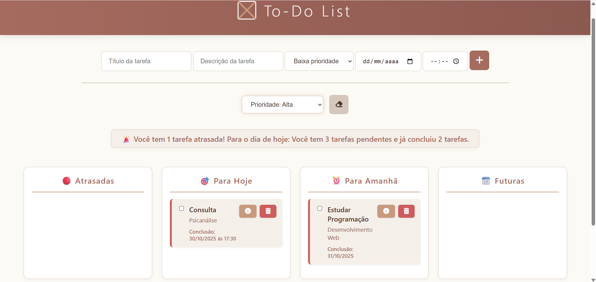

# 🗓️ Smart Taskboard
Gerenciador de tarefas pessoal com colunas Kanban, prioridades, painel de detalhes com subtarefas e salvamento local.
  
Uma aplicação web **minimalista e inteligente** para organização de tarefas, com interface clean, suave e foco total na **usabilidade e produtividade**.  
O projeto foi desenvolvido como parte do meu processo de aprendizado em **lógica de programação e desenvolvimento web**, unindo os conhecimentos obtidos em:

- **Imersão Dev com Google Gemini – Alura (2024)**  
- **Descomplica para Elas – Venturus School & TIC em Trilhas (2025)**  

---

## 🖼️ Interface do Projeto  

### Painel Principal  

### Seletor de Prioridades em Funcionamento  

### Rodapé e Tarefas Concluídas  

---

## 🚀 Funcionalidades Principais  

✅ **Organização Automática no Kanban**  
- As tarefas são classificadas automaticamente em *Atrasadas*, *Para Hoje*, *Para Amanhã* e *Futuras*, com base na **data e horário de conclusão**.  
- Dentro de cada coluna, o sistema prioriza tarefas conforme **nível de prioridade** (alta, média, baixa).  

📝 **Criação e Edição de Tarefas**  
- Adicione título, descrição, data, horário e prioridade.  
- Edite informações diretamente pelo painel de detalhes lateral.  

🧩 **Mini Tarefas (Subtarefas)**  
- Cada tarefa pode conter pequenas subtarefas, permitindo detalhamento granular do que precisa ser feito.  

🎯 **Filtros e Contadores Inteligentes**  
- Filtro dinâmico por prioridade.  
- Contador automático de tarefas pendentes, atrasadas e concluídas.  

💾 **LocalStorage**  
- Os dados são salvos localmente, garantindo que nenhuma tarefa seja perdida ao recarregar a página.  

📱 **Interface Responsiva e Suave**  
- Layout totalmente adaptável para diferentes tamanhos de tela (desktop, tablet e mobile).  
- Visual limpo com **tons terrosos suaves**, tipografia leve e ícones Font Awesome.  

---

## 🧠 Tecnologias Utilizadas  

| Tecnologia | Função |
|-------------|--------|
| **HTML5** | Estrutura semântica da aplicação |
| **CSS3 (Flexbox + Grid)** | Layout responsivo e estilização minimalista |
| **JavaScript (Vanilla)** | Manipulação do DOM, lógica do Kanban e persistência de dados |
| **LocalStorage API** | Armazenamento das tarefas no navegador |
| **Font Awesome** | Ícones interativos e consistentes |

---

## 🎯 Objetivo e Aprendizados  

Este projeto foi criado para **praticar fundamentos de programação e raciocínio lógico**, aplicando conceitos de:
- Estruturação de código JavaScript;
- Manipulação do DOM;
- Condições baseadas em data e hora;
- Persistência de dados;
- UX e acessibilidade.

Ele reflete a transição do aprendizado teórico para a criação prática de um **projeto funcional**, com foco em lógica, design e experiência do usuário.  

---

## 📌 Próximos Passos  

1️⃣ **Aprimorar o painel de detalhes e edição de tarefas**  
2️⃣ **Garantir responsividade total em todos os dispositivos**  
3️⃣ **Implementar alertas automáticos de tarefas atrasadas via notificações do navegador**  
4️⃣ **Projeto futuro (nível avançado): integrar um pet virtual estilo Tamagotchi**  
> O comportamento do pet seria vinculado às ações do usuário na lista — um sistema lúdico de recompensas e produtividade gamificada.

---

## 💡 Como Executar  

Basta abrir o arquivo **`index.html`** em qualquer navegador moderno.  
Não é necessária instalação ou dependência externa.  

---

## 👩‍💻 Autoria  

**Desenvolvido por:** [Ariane Furlan Gazola](https://www.linkedin.com/in/arianegazola)  
📍 *Projeto acadêmico desenvolvido durante o programa Descomplica para Elas (Venturus School & TIC em Trilhas, 2025).*  

GitHub: [@arianegazola](https://github.com/arianegazola)  

---

## 🪄 Destaque Técnico  

> 🔸 O sistema de **organização automática no Kanban** é totalmente baseado em lógica de data/hora e prioridade, desenvolvido em **JavaScript puro**, sem frameworks.  
> Essa funcionalidade foi pensada para simular o comportamento de um **gerenciador de tarefas inteligente**.

---

## 🏗️ Status do Projeto  
🚧 Em desenvolvimento  
- Estrutura principal funcional  
- Refinamento de layout e recursos em andamento  

---

## 📜 Licença  

Este projeto é de uso educacional e pode ser reutilizado ou adaptado com atribuição.  
© 2025 Ariane Furlan Gazola. Todos os direitos reservados.

